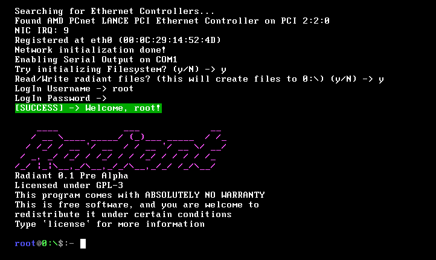
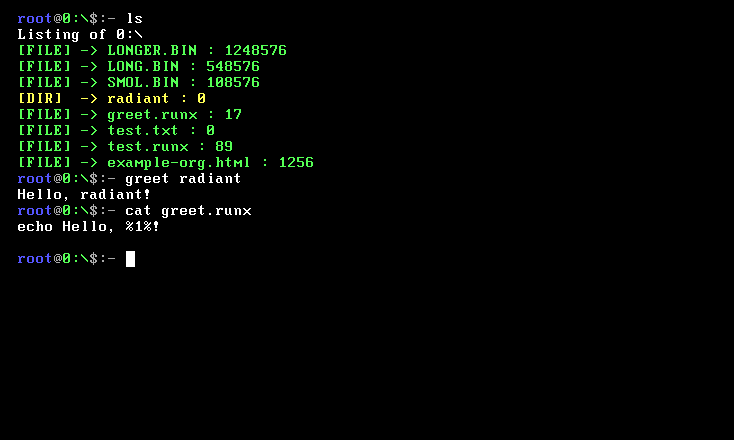
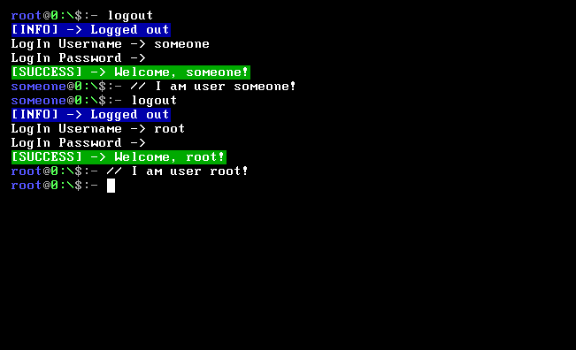
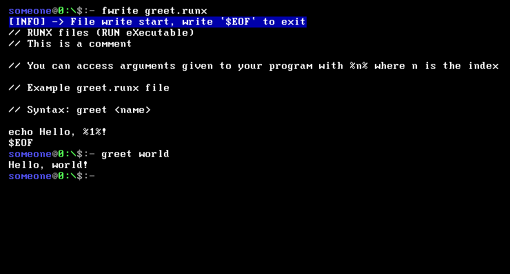
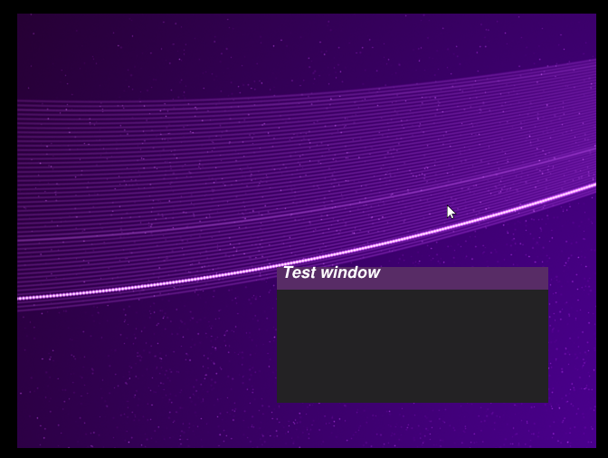
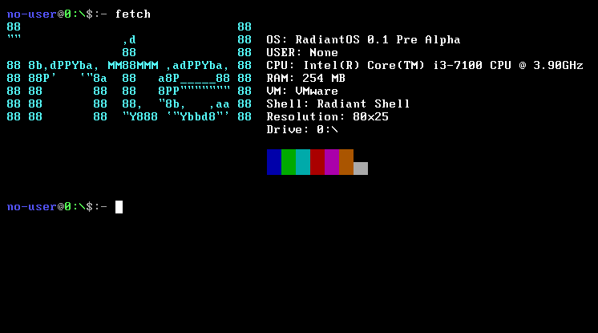

<h1>Radiant Operating System</h1>

Radiant is an Operating System written in C# Using the <a href="https://github.com/CosmosOS/Cosmos">Cosmos</a> Library

<h1>Current Features</h1>

<table>
  <tr>
    <td>
      <h3>Command-line Interface</h3>
      

        A powerful command parser with argument and keyword argument support
      

    </td>
    <td>
      
    </td>
  </tr>
  <tr>
    <td>
      
    </td>
    <td>
       <h3>Filesystem</h3>
      

        For now it only supports some filesystems, but we will also try adding support for other filesystems
      

    </td>
  </tr>
  <tr>
   <td>
      <h3>User Management</h3>
      

        User management system. Each user has its own unique username, password and working directory!
      

    </td>
    <td>
      
    </td>
     <tr>
    <td>
      
    </td>
    <td>
       <h3>Custom Executables</h3>
      

        Write and run your own commands with RUNX (RUN eXecutable)
      

    </td>
  </tr>
  </tr>
    <tr>
    <td>
      
    </td>
    <td>
       <h3>Graphics</h3>
      

        VERY basic graphics (for now)
      

    </td>
</table>
<h2>Other Screenshots</h2>

<h2>Contributors</h2>
<table>
  <tr>
    <td>
      
    </td>
    <td>
      <a href="https://github.com/Vardan2009">Vardan2009</a>
    </td>
  </tr>
   <tr>
    <td>
      
    </td>
    <td>
      <a href="https://github.com/gamma63">gamma63</a>
    </td>
  </tr>
</table>

